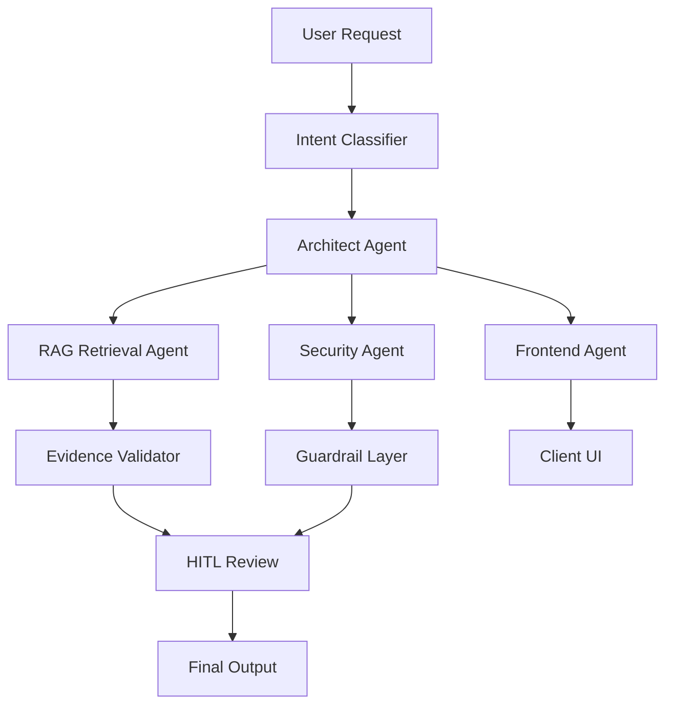

# Peacock: GitHub Profile Branding (ResumeBrand)

**Skill name:** `ultra_github_profile_repo_architect`  
**Purpose:** transform GitHub from certifications/intro into CEO-grade technical portfolio.  
**Target impression:** million-dollar companies, AI executives, FAANG recruiters, CTOs, startup founders.  
**Positioning:** Multi-Agent Orchestration | Agentic AI | RAG | AI Architecture | Forward Deployed Engineering | Secure AI Systems.

---

## 1. Mission

Upgrade GitHub into an elite AI systems portfolio.

Goal:

```text
Not student profile.
Not certification wall.
Not generic intro.
Show builder.
Show architect.
Show systems.
Show proof.
Show security maturity.
Show executive clarity.
```

Primary brand signal:

```text
I build multi-agent systems that reason, retrieve, orchestrate, validate, and ship.
```

---

## 2. Core Positioning

Main identity:

```text
AI Architect | Forward Deployed Engineer | Multi-Agent Orchestration Builder
```

Supporting identity:

```text
RAG Systems
Agentic Workflows
Secure AI Platforms
Human-in-the-Loop Governance
Observability
React + FastAPI Prototypes
Client-Ready AI Products
```

Avoid leading with:

```text
Certifications
School projects
Long personal biography
Generic cybersecurity intro
Basic GitHub stats only
```

Certifications may stay lower page.

---

## 3. GitHub Profile README Structure

Use this structure:

```text
1. Hero banner
2. One-line technical identity
3. Mission statement
4. Featured systems
5. Agentic architecture stack
6. Live demos / case studies
7. Technical thesis / frameworks
8. Repo map
9. Security + governance principles
10. Toolchain
11. Certifications / education
12. Contact
```

---

## 4. Hero Section

Recommended headline:

```text
Samuel Quansah
AI Architect | Forward Deployed Engineer | Multi-Agent Orchestration
```

Hero tagline:

```text
I build agentic systems that turn ambiguous business problems into secure, observable, deployable AI products.
```

Alternative taglines:

```text
Building the orchestration layer between AI reasoning and real-world execution.

Designing secure multi-agent systems for enterprise-grade AI deployment.

From RAG to reasoning, from agents to execution.
```

---

## 5. GitHub README Opening Copy

Use:

```md
# Peacock: GitHub Profile Branding (ResumeBrand)

**AI Architect | Forward Deployed Engineer | Multi-Agent Orchestration Builder**

I design and build agentic AI systems that combine RAG, multi-agent orchestration, secure backend architecture, human-in-the-loop governance, and client-ready frontend demos.

My work focuses on turning ambiguous client problems into deployable AI prototypes with clear architecture, observable reasoning, retrieval guardrails, and executive-ready documentation.
```

---

## 6. Featured Systems Section

Create section:

```md
## Featured AI Systems
```

Feature 4-6 projects max.

Recommended projects:

```text
1. CareIntel Brief
2. CHI Framework
3. DeepStride AI
4. Multi-Agent Architect Agent
5. Retrieval Token Guardrail System
6. React Agentic Dashboard
```

Project card format:

```md
### Project Name
**Type:** Multi-agent AI system / RAG platform / frontend demo  
**Stack:** Python, FastAPI, React, TypeScript, RAG, vector DB, HITL  
**What it does:** one sentence  
**Why it matters:** one sentence  
**Repo:** link  
**Demo:** link  
**Case Study:** link
```

---

## 7. Project Descriptions

### CareIntel Brief

```text
Healthcare strategy briefing system that uses RAG and multi-agent orchestration to generate condition-level intelligence across standard of care, emerging treatments, clinical trials, companies, institutions, citations, and risk flags.
```

### CHI Framework

```text
Cognitive Hidden Intelligence framework for making invisible agent reasoning visible through observability, belief state tracking, logic layers, source traces, and human-in-the-loop governance.
```

### DeepStride AI

```text
Startup web platform for agentic systems deployable into physical-world workflows, with a future-facing extension into quantum-inspired AI research.
```

### Multi-Agent Architect Agent

```text
Architect Agent that decomposes client problems into specialized sub-agents for retrieval, clinical evidence synthesis, regulatory intelligence, company mapping, security validation, and human review.
```

### Retrieval Token Guardrail System

```text
Cost-aware RAG control layer that prevents broad retrieval, caps top_k, routes queries by intent, compresses evidence, caches repeated briefings, and escalates budget expansion for human approval.
```

---

## 8. Repo Naming Standard

Use clean repo names.

Recommended:

```text
careintel-brief
chi-framework
deepstride-ai-site
multi-agent-architect
rag-token-guardrails
agentic-dashboard-react
healthcare-strategy-rag
agentic-observability-kit
```

Avoid:

```text
test
final-project
my-app
new-repo
certification-project
untitled
project1
```

---

## 9. Repo Folder Structure Standard

For serious AI repos:

```text
repo-name/
  README.md
  docs/
    architecture.md
    api.md
    security.md
    deployment.md
    testing.md
    governance.md
  src/
    agents/
    rag/
    guardrails/
    orchestration/
    observability/
    api/
    frontend/
  tests/
  examples/
  assets/
    diagrams/
    screenshots/
  reports/
  .env.example
  requirements.txt
  package.json
  docker-compose.yml
  LICENSE
```

For frontend repos:

```text
repo-name/
  README.md
  src/
    components/
    pages/
    routes/
    services/
    data/
    styles/
  public/
  docs/
    design.md
    api-integration.md
    deployment.md
  assets/
    screenshots/
  package.json
  vite.config.ts
  tailwind.config.js
```

---

## 10. Repo README Template

Every repo must include:

```md
# Peacock: GitHub Profile Branding (ResumeBrand)

## What It Is
Short description.

## Why It Matters
Business / technical value.

## Architecture
Diagram + explanation.

## Core Features
- Feature
- Feature
- Feature

## Agent / System Flow
User input -> agent routing -> retrieval/tool use -> validation -> output.

## Tech Stack
List.

## Security + Governance
RBAC, audit logs, validation, HITL, source grounding.

## Local Setup
Commands.

## Demo
Screenshots, video, deployment link.

## Roadmap
Next build steps.

## Status
Prototype / active build / case study.

## Disclaimer
No fake production claims.
```

---

## 11. Architecture Diagram Requirement

Each major repo needs one diagram.

Use Mermaid first.



---

## 12. GitHub Main Page Visuals

Add:

```text
Minimal banner
Animated typing line optional
Project badges
Pinned project cards
Architecture diagrams
Live demo links
Case study links
Tech stack badges
```

Do not overuse:

```text
Too many badges
Too many emojis
GIF overload
Cluttered stats panels
```

Recommended badge categories:

```text
Python
FastAPI
React
TypeScript
LangChain
LangGraph
RAG
Docker
AWS
Azure
Security
Observability
```

---

## 13. CEO / CTO Impression Layer

GitHub must communicate:

```text
Can build.
Can architect.
Can explain.
Can secure.
Can demo.
Can ship.
Can document.
Can handle enterprise ambiguity.
```

Add section:

```md
## How I Build

1. Discover the business problem
2. Decompose into agent responsibilities
3. Design secure RAG + backend architecture
4. Build frontend demo for stakeholder validation
5. Add guardrails, HITL, observability, and cost controls
6. Package client and engineering deliverables
```

---

## 14. Security-First Positioning

Add section:

```md
## Security + Governance Principles

- Security before features
- No source = no claim
- Least privilege by default
- Human approval for critical actions
- Observable agent reasoning
- Retrieval cost controls
- No hidden data ingestion
- Audit logs for sensitive workflows
```

---

## 15. Portfolio Case Study Format

Each case study:

```text
Problem
Client context
Architecture
Agent team
RAG workflow
Security controls
HITL gates
Observability
Frontend demo
Backend/API design
Deliverables
Lessons learned
```

Keep concise.

---

## 16. Pinned Repo Strategy

Pin 6 repos:

```text
1. careintel-brief
2. chi-framework
3. deepstride-ai-site
4. multi-agent-architect
5. rag-token-guardrails
6. agentic-dashboard-react
```

Priority:

```text
Systems > certificates
Architecture > tutorials
Demos > notes
Case studies > simple scripts
```

---

## 17. Profile README Sections To Downplay

Move low on page:

```text
Certifications
School coursework
General intro
Basic tools only
Long personal story
```

Keep if relevant:

```text
Navy veteran discipline
Cybersecurity foundation
Cloud/security certifications
Healthcare AI case study
```

---

## 18. GitHub Action Items

Claude must generate:

```text
1. New GitHub profile README.md
2. Repo naming strategy
3. Pinned repo plan
4. Standard repo README template
5. Standard architecture.md template
6. Standard security.md template
7. Standard governance.md template
8. Standard demo.md template
9. Case study template
10. GitHub cleanup checklist
```

---

## 19. Human Validation Gates

Pause for Samuel approval before claiming:

```text
Production deployment
Enterprise client
Paid customer
Revenue
FAANG interview
Security clearance
HIPAA compliance
Quantum capability
Patented technology
Team size
Funding
```

If unverified, write:

```text
Prototype
Case study
Demo system
Research framework
Founder-led build
```

---

## 20. Claude Invocation Prompt

Use this exact prompt:

```text
Use the Ultra GitHub Profile + Repo Architect skill.

Transform my GitHub from certification-heavy to elite AI builder portfolio.

Position me as:
AI Architect,
Forward Deployed Engineer,
Multi-Agent Orchestration Builder,
RAG Systems Engineer,
Agentic AI Product Builder,
Security-first technical strategist.

Make the profile impress CEOs, CTOs, recruiters, and million-dollar companies.

Do not fabricate production claims, clients, revenue, certifications, employment, funding, patents, or compliance status.
Use prototype, case study, demo, or research framework where needed.

Create:
1. GitHub profile README.md
2. Pinned repo strategy
3. Repo naming cleanup plan
4. Standard repo structure
5. Standard README template
6. Architecture doc template
7. Security doc template
8. Governance doc template
9. Case study template
10. GitHub cleanup checklist

Style:
ultra-modern,
technical,
confident,
concise,
founder-grade,
FAANG-caliber,
CEO-readable.

Core message:
I build secure, observable, multi-agent AI systems from concept to client-ready prototype.
```

---

## 21. Acceptance Criteria

Pass if GitHub now shows:

```text
1. Clear AI Architect identity
2. Multi-agent orchestration dominance
3. RAG systems credibility
4. Security/governance maturity
5. Client-facing delivery
6. Clean repo structure
7. Strong pinned projects
8. Case-study quality README files
9. No fake claims
10. CEO/recruiter wow factor
```
