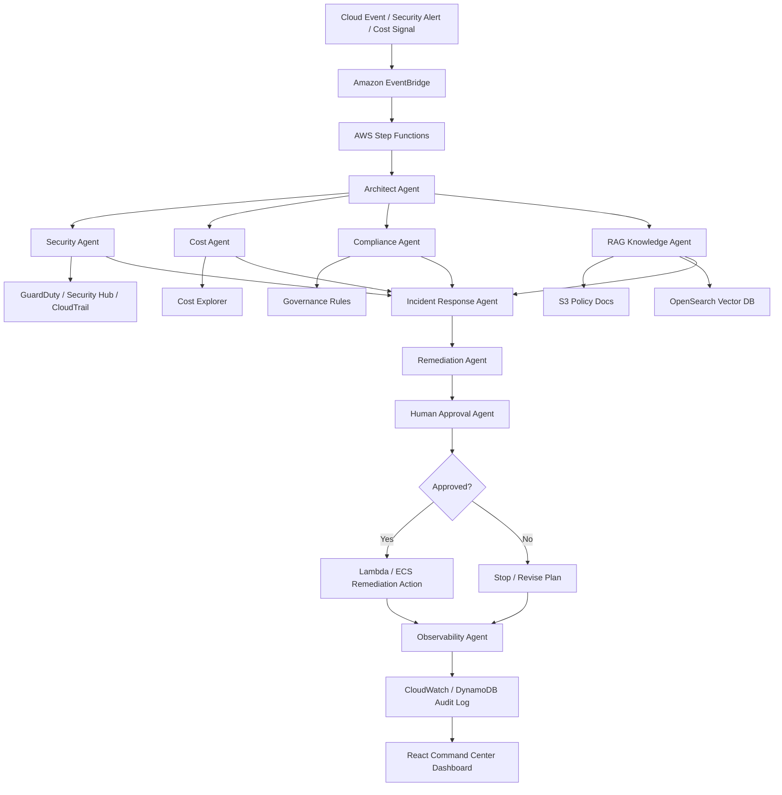

# Polaris: AWS Agentic Orchestration (CloudDeploy)

**Skill name:** `aws_multi_agent_orchestration`  
**Purpose:** build an AWS-native multi-agent orchestration demo that proves enterprise-grade AI architecture.  
**Project name:** Enterprise Agentic Operations Command Center  
**Repo name:** `aws-agentic-ops-command-center`  
**Audience:** AI Architect interviewer, CTO, enterprise client, FAANG-style reviewer.

---

## 1. Mission

Build a high-level AWS project that demonstrates:

```text
Multi-agent orchestration
AWS-native enterprise architecture
Security-first AI workflows
Human-in-the-loop approvals
RAG-based policy reasoning
Cloud incident analysis
Cost-aware remediation
Full observability
```

Core pitch:

```text
An enterprise command center where AI agents detect events, reason across cloud/security/business context, recommend action, request approval, then execute controlled remediation.
```

---

## 2. Primary Demo Scenario

Default scenario:

```text
AWS security/cost event detected
↓
Agents investigate
↓
RAG checks policy/runbook evidence
↓
Compliance agent evaluates risk
↓
Cost agent estimates impact
↓
Remediation agent proposes fix
↓
Human approves
↓
AWS action executes
↓
Observability logs full trace
```

---

## 3. Required Agents

```text
1. Architect Agent
2. Security Agent
3. Cloud Cost Agent
4. Incident Response Agent
5. Compliance Agent
6. RAG Knowledge Agent
7. Remediation Agent
8. Human Approval Agent
9. Observability Agent
```

---

## 4. Agent Responsibilities

### Architect Agent

```text
Classifies event.
Selects agent team.
Controls orchestration.
Routes task through Step Functions.
```

### Security Agent

```text
Analyzes GuardDuty, Security Hub, IAM, CloudTrail signals.
Flags suspicious activity.
Recommends containment.
```

### Cloud Cost Agent

```text
Checks Cost Explorer data.
Estimates spend impact.
Flags waste, anomaly, or overprovisioning.
```

### Incident Response Agent

```text
Creates incident summary.
Ranks severity.
Builds response timeline.
```

### Compliance Agent

```text
Checks policy alignment.
Flags governance risk.
Blocks unsafe remediation.
```

### RAG Knowledge Agent

```text
Retrieves internal policy docs.
Retrieves runbooks.
Retrieves architecture docs.
Returns source-grounded evidence.
```

### Remediation Agent

```text
Proposes AWS fix.
Does not execute without approval.
Creates remediation plan.
```

### Human Approval Agent

```text
Pauses critical workflow.
Requests approval.
Records approve/reject/revise decision.
```

### Observability Agent

```text
Logs agent actions.
Captures source traces.
Captures token/cost metrics.
Captures final decision trail.
```

---

## 5. AWS Architecture

Use:

```text
Amazon EventBridge
AWS Step Functions
Amazon Bedrock
AWS Lambda
Amazon ECS optional
Amazon S3
Amazon OpenSearch Serverless / Vector Engine
Amazon DynamoDB
Amazon SQS
Amazon CloudWatch
AWS CloudTrail
Amazon GuardDuty
AWS Security Hub
AWS Cost Explorer
AWS IAM
AWS KMS
AWS Secrets Manager
Amazon Cognito
Amazon API Gateway
AWS Amplify or S3 + CloudFront
```

---

## 6. Architecture Diagram



---

## 7. RAG Workflow

Sources:

```text
1. Internal security policies
2. AWS runbooks
3. Incident response playbooks
4. Compliance rules
5. Cost optimization rules
6. Architecture documentation
```

Pipeline:

```text
Upload docs to S3
↓
Chunk docs
↓
Embed with Bedrock Embeddings
↓
Store vectors in OpenSearch
↓
Retrieve by event intent
↓
Compress evidence
↓
Attach citations
↓
Send to agent
```

Guardrail:

```text
No source = no claim.
No policy evidence = escalate to human.
```

---

## 8. Human-in-the-Loop Rules

Approval required before:

```text
IAM permission change
Security group change
Resource shutdown
Data deletion
Production remediation
Budget expansion
Policy override
External notification
```

Default behavior:

```text
Recommend only.
Do not execute.
Wait for human approval.
```

---

## 9. Security Requirements

Implement:

```text
Least privilege IAM
KMS encryption
Secrets Manager
No hardcoded secrets
CloudTrail audit logs
Cognito auth
RBAC-ready roles
Input validation
Output validation
Safe remediation allowlist
Human approval gates
```

Roles:

```text
Admin
Security Reviewer
Cloud Ops Reviewer
Read-only Executive
Demo User
```

---

## 10. Observability Requirements

Track:

```text
Event ID
Agent selected
Tool called
AWS service queried
Source retrieved
Claim generated
Risk score
Cost estimate
Approval status
Remediation action
Token usage
Latency
Final outcome
```

Store:

```text
DynamoDB for agent traces
CloudWatch for logs
S3 for reports
```

Dashboard widgets:

```text
Active incidents
Agent trace timeline
Risk score
Cost estimate
Human approval queue
Remediation status
Token usage
RAG source confidence
```

---

## 11. Frontend Dashboard

Pages:

```text
Login
Command Center
Incident Detail
Agent Trace
RAG Evidence
Human Approval Queue
Cost + Token Metrics
System Health
```

Design:

```text
Dark enterprise UI
Green/blue signal accents
Live workflow nodes
Executive-readable metrics
React Flow for agent map
```

---

## 12. API Endpoints

```text
POST /events/simulate
GET /incidents
GET /incidents/:id
GET /incidents/:id/trace
GET /incidents/:id/evidence
POST /approval/:id
GET /metrics
GET /health
```

---

## 13. Demo Events

Seed test events:

```text
1. Public S3 bucket detected
2. Over-permissive IAM role detected
3. EC2 cost spike detected
4. Unusual login location detected
5. Security group open to 0.0.0.0/0
```

Each event triggers:

```text
Classification
Agent routing
Evidence retrieval
Risk scoring
Remediation recommendation
Human approval
Trace logging
```

---

## 14. Cost Control

Use demo-safe defaults:

```text
Mock AWS events first.
Use limited Bedrock calls.
Cache RAG responses.
Cap top_k.
Cap token budget.
Do not run broad retrieval.
Use simulated remediation unless approved.
```

Token guardrails:

```yaml
max_top_k: 5
max_context_tokens: 3000
max_agent_rounds: 2
cache_enabled: true
human_approval_for_budget_expansion: true
```

---

## 15. Repository Structure

```text
aws-agentic-ops-command-center/
  README.md
  docs/
    architecture.md
    agents.md
    security.md
    rag.md
    observability.md
    deployment.md
    demo-script.md
  infra/
    cdk/
      app.py
      stacks/
  src/
    agents/
      architect_agent.py
      security_agent.py
      cost_agent.py
      incident_agent.py
      compliance_agent.py
      rag_agent.py
      remediation_agent.py
      human_approval_agent.py
      observability_agent.py
    api/
      main.py
      routes/
    rag/
      ingest.py
      retrieve.py
      compress.py
    orchestration/
      step_function_definition.json
      router.py
    guardrails/
      permissions.py
      token_budget.py
      remediation_allowlist.py
    observability/
      traces.py
      metrics.py
  frontend/
    src/
      pages/
      components/
      services/
  tests/
    test_agents.py
    test_guardrails.py
    test_rag.py
    test_approval.py
  examples/
    demo_events.json
  .env.example
  docker-compose.yml
```

---

## 16. Build Phases

### Phase 1 — Architecture

```text
Define agents.
Define event flow.
Define AWS services.
Define security gates.
```

### Phase 2 — Mock Demo

```text
Use mock AWS events.
Use local agent orchestration.
Use mock RAG docs.
Use simulated remediation.
```

### Phase 3 — AWS Integration

```text
Add EventBridge.
Add Step Functions.
Add Lambda.
Add S3 + OpenSearch.
Add CloudWatch/DynamoDB logs.
```

### Phase 4 — Frontend

```text
Build command center dashboard.
Show agent flow.
Show approval queue.
Show metrics.
```

### Phase 5 — Enterprise Hardening

```text
IAM least privilege.
KMS.
Secrets.
Cognito.
Audit logs.
Deployment docs.
```

---

## 17. Interview Pitch

```text
I built an AWS-native Enterprise Agentic Operations Command Center. It demonstrates multi-agent orchestration across security, cost, compliance, RAG policy retrieval, remediation planning, human approval, and observability. The architecture uses EventBridge, Step Functions, Bedrock, Lambda, S3, OpenSearch, DynamoDB, CloudWatch, GuardDuty, Security Hub, and Cost Explorer. It is designed like an enterprise system, not a toy chatbot.
```

---

## 18. Claude Code Invocation Prompt

```text
Use the AWS Multi Agent Orchestration skill.

Build an AWS-native Enterprise Agentic Operations Command Center demonstrating high-level multi-agent orchestration.

Project repo:
aws-agentic-ops-command-center

Core demo:
AWS event is detected.
Architect Agent routes task.
Security, Cost, Compliance, RAG, Incident, and Remediation agents collaborate.
Human Approval Agent pauses risky actions.
Observability Agent logs full trace.
Approved remediation executes through Lambda.

Use AWS services:
EventBridge,
Step Functions,
Bedrock,
Lambda,
S3,
OpenSearch Vector DB,
DynamoDB,
CloudWatch,
CloudTrail,
GuardDuty,
Security Hub,
Cost Explorer,
IAM,
KMS,
Secrets Manager,
Cognito,
API Gateway,
React dashboard.

Start with mock mode.
Do not execute real remediation.
Use simulated AWS events first.
Add human approval before any destructive or permission-changing action.
Security is foundational.
No hardcoded secrets.
Least privilege IAM.
Log all agent decisions.

Deliver:
architecture docs,
agent definitions,
backend scaffold,
RAG scaffold,
guardrails,
observability logs,
React dashboard,
demo script,
deployment plan.
```

---

## 19. Acceptance Criteria

```text
1. Shows true multi-agent orchestration.
2. Uses AWS-native architecture.
3. Includes RAG policy reasoning.
4. Includes human-in-the-loop approval.
5. Includes observability traces.
6. Includes cost/token metrics.
7. Includes security-first controls.
8. Uses mock mode before live AWS execution.
9. Has clear README + architecture diagram.
10. Looks enterprise-grade.
```
